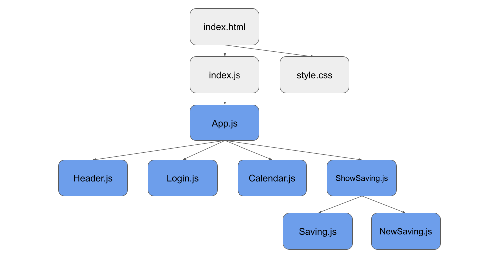

# STARLING API SAVING
> Add money into a saving account on Starling Bank.
> Live demo [_here_](https://98ubuo.csb.app/).

## Table of Contents
* [General Info](#general-information)
* [Technologies Used](#technologies-used)
* [Features](#features)
* [Project Hierarchy](#progect-hierarchy)
* [Setup](#setup)
* [Contact](#contact)

## General Information
- This project intend to fulfill a challenge given by Starling Bank to candidates for a SE role.
- The challenge constists on creating a web app capable to average the money spent by a customer in a given week and put send this amount in a saving account using the Starling Bank public [_API_](https://developer.starlingbank.com/docs).

## Technologies Used
- HTML 
- CSS
- Material-UI - version 4.12.4
- React.js - version 18.0.0

## Features
- Login: 
user can login using the account token. After inserting a valid token the name associated with the token is displayed in the upper right side.

- Average spent: 
a custom billing week period can be selected in the calendar. After selecting the starting date the end date (7 days later) is automatically shown.
After selecting the billing period the weekly average spent is displayed.    

- Saving account:
If spending transaction are present in the selected billing period all the saving account are shown. By clicking a saving account the average amount is sent in to the saving account.

- New saving account: 
A new saving account can be created if a valid billing period is selected. A name and a money target are the needed input for the new saving account.

## Project Hierarchy
The image below shows the project hierarchy. The blu square are the React components which are all child of App.js which is rendered by index.js from the main file index.html. 

## Setup
The project has two main dependencies, React and Material-UI. The dependencies are listed in the package.json file so the project can be initialized in a local environment using the [_npm_](https://docs.npmjs.com/getting-started) package with the following commands

`npx create-react-app` to initialize react.js.

`npm install` to install the dipendencies from the package.json file.

`npm start` to run a React server in the localhost.

## Contact
Created by [Jacopo Montefusco](montefuscojacopo@gmail.com) - feel free to contact me!